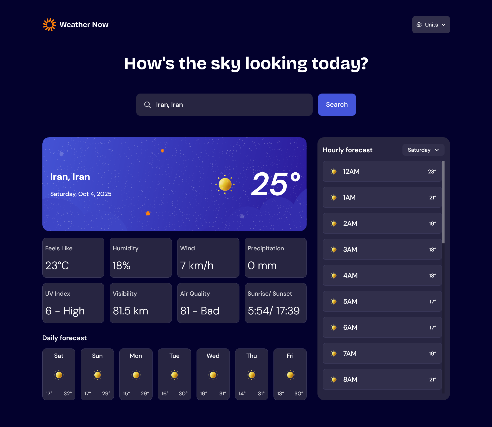

# Frontend Mentor - Weather app solution

This is a solution to the [Weather app challenge on Frontend Mentor](https://www.frontendmentor.io/challenges/weather-app-K1FhddVm49). Frontend Mentor challenges help you improve your coding skills by building realistic projects.

## Table of contents

- [Overview](#overview)
  - [The challenge](#the-challenge)
  - [Screenshot](#screenshot)
  - [Links](#links)
- [My process](#my-process)
  - [Built with](#built-with)
  - [What I learned](#what-i-learned)
  - [Continued development](#continued-development)
  - [Useful resources](#useful-resources)
- [Author](#author)
- [Acknowledgments](#acknowledgments)

## Overview

### The challenge

Users should be able to:

- Search for weather information by entering a location in the search bar
- View current weather conditions including temperature, weather icon, and location details
- See additional weather metrics like "feels like" temperature, humidity percentage, wind speed, and precipitation amounts
- Browse a 7-day weather forecast with daily high/low temperatures and weather icons
- View an hourly forecast showing temperature changes throughout the day
- Switch between different days of the week using the day selector in the hourly forecast section
- Toggle between Imperial and Metric measurement units via the units dropdown
- Switch between specific temperature units (Celsius and Fahrenheit) and measurement units for wind speed (km/h and mph) and precipitation (millimeters) via the units dropdown
- View the optimal layout for the interface depending on their device's screen size
- See hover and focus states for all interactive elements on the page

### Screenshot



### Links

- Solution URL: [GitHub Repository](https://github.com/kaamiik/fm-weather-app-using-next-tailwind-typescript)
- Live Site URL: [Preview by Vercel](https://weather-app-kiaaka.vercel.app/)

## My process

### Built with

- Semantic HTML5 markup
- Flexbox
- CSS Grid
- Mobile-first workflow
- Accessibility
- [TailwindCSS](https://tailwindcss.com/) - For styles
- [React](https://reactjs.org/) - JS library
- [Next.js](https://nextjs.org/) - React framework
- [TypeScript](https://www.typescriptlang.org/) - For Types
- [React Aria Components](https://react-spectrum.adobe.com/react-aria/index.html) - Unstyled Accessible Components

### What I learned

Building this weather app taught me several important concepts about modern web development. Here's what I learned:

#### HTML Structure and Semantic Markup

I focused on creating a proper HTML structure with semantic tags for better accessibility and SEO. The app uses semantic elements like `<main>`, `<section>`, and proper heading hierarchy.

```html
<body>
  <div>
    <!-- Page container -->
    <PageHeader />
    <main>
      <h1>Page Heading</h1>
      <div>
        <SearchForm />
      </div>
      <div>
        <div>
          <div>Location and Weather Info</div>
          <section>Weather Details</section>
        </div>
        <section>Daily Forecast</section>
        <section>Hourly Forecast</section>
      </div>
    </main>
  </div>
</body>
```

#### Responsive Design Challenges

Making the app work on different screen sizes was challenging. The main issue was with the **WeatherSection** grid layout on desktop screens. The **HourlyForecast** component needed to have overflow and its height should depend on the first column's components height. I solved this using:

```css
.hourly-container {
  contain: size;
  overflow-y: auto;
  /* Other styles */
}
```

#### Next.js Data Fetching and Server Components

I used Next.js for server-side rendering and React Server Components (RSC) to improve performance. The main challenge was implementing proper data fetching with caching using `fetch` with `next: { revalidate: 600 }` for both weather and air quality APIs. I also learned how to handle search parameters in server components and use Suspense for loading states.

#### TypeScript for Type Safety

I used TypeScript to define comprehensive types for weather data, location data, and search parameters. This helped prevent bugs and made the code more maintainable. The main types I created were `WeatherData`, `LocationData`, `SearchParams`, and `NominatimResponse`.

#### React Aria Components for Accessibility

For components that needed both accessibility and custom styling, I used **React Aria Components**. The main components I implemented were:

- **UnitSettings**: Used Menu, MenuTrigger, MenuItem, and Popover for unit selection
- **SearchInput**: Used ComboBox, Input, ListBox, and ListBoxItem for location search
- **DaysDropdown**: Used Select, Button, and ListBox for day selection

These components provided full accessibility features while allowing complete custom styling.

#### Component Architecture

I broke down the app into smaller, reusable components for better maintainability:

- **WeatherSection**: Main container that orchestrates all weather components
- **WeatherInfo**: Displays current weather conditions
- **WeatherDetails**: Shows additional weather metrics
- **DailyForecast**: 7-day weather forecast
- **HourlyForecast**: Hourly weather data with day selection
- **SearchForm**: Location search functionality
- **GeolocationHandler**: Handles user location detection

This modular approach made the code more organized and easier to maintain.

### Continued development

I'm proud of implementing a fully accessible weather app with proper semantic HTML, TypeScript type safety, and responsive design. For future improvements, I want to focus on performance optimization and adding more user-friendly features.

**Next steps:**

- Optimize rendering performance and reduce bundle size
- Add latitude/longitude search functionality
- Implement smart suggestions (umbrella alerts, pollution warnings)
- Add more weather data visualization

### Useful resources

- [Grid Layout Height Restriction](https://discord.com/channels/824970620529279006/1422214638581452890) - Helped solve the overflow issue in my grid layout
- [Server-side Fetching Strategy 1](https://discord.com/channels/824970620529279006/1417439000737746994) and [Strategy 2](https://discord.com/channels/824970620529279006/1416149764730392720) - Guided my data fetching approach and server/client component decisions
- [Accessibility Issues Discussion](https://discord.com/channels/824970620529279006/1422609177972445224) - Helped identify and fix accessibility problems

## Author

- Frontend Mentor - [@kaamiik](https://www.frontendmentor.io/profile/kaamiik)
- X - [@kiaakamran](https://www.x.com/kiaakamran)
- BlueSky - [@kiaaka.bsky.social](https://bsky.app/profile/kiaaka.bsky.social)

## Acknowledgments

I want to thank Frontend Mentor for this great opportunity and the amazing mentors in the Discord community: Alex K. Marshall, Grace Snow, DarkStar, and Chamu. They helped me solve bugs and understand complex concepts throughout this project.
